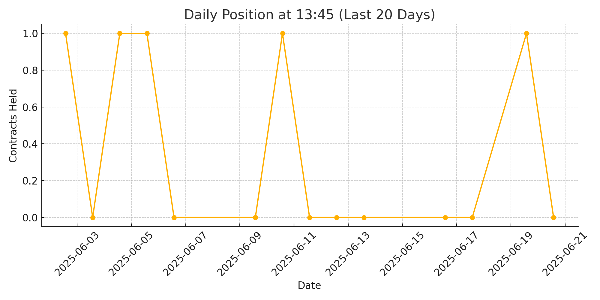

# 📈 DualFrame CCI-TWAP Trading System

The DualFrame CCI-TWAP System is designed to generate high-confidence directional signals through statistical filtering of normalized price deviation metrics (CCI) across two temporal resolutions. A time-weighted average price (TWAP) component is used as a dynamic price anchor to regulate signal activation, enhancing noise suppression and trend alignment without reliance on conventional chart-based techniques.

A directional, quantitative-filtered momentum strategy that integrates multi-horizon signal alignment (via CCI) with time-weighted price anchoring (TWAP) for noise reduction and trend validation.

*This README was automatically generated as part of a real-time strategy monitoring and reporting system.*

## 📌 Strategy Attributes

- **Strategy Name:** DualFrame CCI-TWAP System  
- **Asset:** Taiwan Index Futures (TXF)    
- **Type:** Momentum-Based Trend-Following  
- **Data Frequency:** 10-minute bars  
- **Holding Duration:** 1.5 to 3 days
- 
## 📌 Strategy Overview

This table provides a comprehensive summary of the trading strategy based on live and backtested data, covering both long and short trades.

Key performance metrics include:
- Sharpe Ratio
- CAGR (Annualized Return)
- Maximum Drawdown
- Profit Factor
- Win Rate (%)

## 📊 Strategy Performance Report

### 📌 General Performance Metrics

| Metric | All Trades | Long Trades | Short Trades |
|--------|------------|-------------|--------------|
| **Net Profit** | 4,675,700 | 2,530,600 | 2,145,100 |
| **Adjusted Net Profit** | 3,758,009 | 1,823,471 | 1,534,731 |
| **Gross Profit** | 15,804,600 | 10,152,200 | 5,652,400 |
| **Gross Loss** | -11,128,900 | -7,621,600 | -3,507,300 |
| **Max Drawdown** | -577,400 | -447,500 | -293,000 |
| **Max Drawdown (%)** | -8.98% | -10.29% | -8.04% |
| **Max Trade Loss** | -551,600 | -390,400 | -234,600 |
| **Max Trade Loss (%)** | -8.59% | -9.06% | -6.46% |
| **Win Rate** | 44.82% | 46.78% | 39.67% |
| **Total Trades** | 1,776 | 1,287 | 489 |
| **Max Contracts Held** | 2 | 2 | 2 |

---

### 📌 Return Statistics

| Metric | Value |
|--------|-------|
| **Required Capital** | 551,600 |
| **Account Return (%)** | 847.66% |
| **Return on Initial Capital (%)** | 233.79% |
| **Annualized Return (%)** | 29.21% |
| **Monthly Return (%)** | 2.43% |
| **Buy-and-Hold Return** | 2,177,535 |
| **Average Monthly Return** | 48,203 |
| **Monthly Return StdDev** | 112,044 |

---

### 📌 Profitability Ratios

| Ratio | Value |
|-------|-------|
| **Profit Factor** | 1.42 |
| **Adjusted Profit Factor** | 1.33 |
| **Specific Profit Factor** | 1.38 |
| **Return After Max DD** | 8.10 |
| **Slippage Paid** | 1,935,500 |
| **Commission Paid** | 0 |

---

## Performance Ratios

| Metric | Value |
|--------|-------|
| **Upside Potential Ratio** | 172.58 |
| **Sharpe Ratio** | 0.47 |
| **Annual Sharpe Ratio** | 1.64 |
| **Sortino Ratio** | 1.29 |
| **Fouse Ratio** | 0.0126 |
| **Calmar Ratio** | 0.0194 |
| **Sterling Ratio** | 0.0020 |

---

## 🧮 Return-to-Drawdown Metrics

| Metric | Value |
|--------|-------|
| Net Profit / Max Loss (%) | 4,620.26% |
| Net Profit / Max Trade DD (%) | 4,369.81% |
| Net Profit / Max Strategy DD (%) | 809.79% |
| Specific Net / Max Loss (%) | 2,483.89% |
| Specific Net / Max Trade DD (%) | 2,349.25% |
| Specific Net / Max Strategy DD (%) | 435.35% |
| Adjusted Net / Max Loss (%) | 3,713.45% |
| Adjusted Net / Max Trade DD (%) | 3,512.16% |
| Adjusted Net / Max Strategy DD (%) | 650.85% |
## Position Chart (Last 20 Days @13:45)

## Sample Position Table (Last 20 Days)

File: `data/last20days_table.csv`

## Files Included

- `data/pos_TXFstrategyC.csv`: Raw position data
- `charts/last20days_chart.png`: Recent position chart
- `data/last20days_table.csv`: Filtered table at 13:45
- `.github/workflows/update_positions.yml`: GitHub Action for daily updates
- `scripts/update_and_plot.py`: Python script for processing and chart generation

---

_Last Updated: 2025-06-22_
