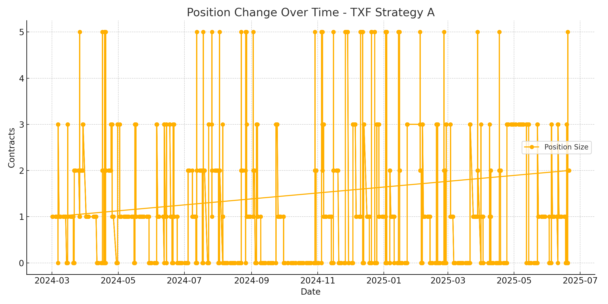

# TXF Strategy A – Position Tracker

This repository tracks the position changes of the TXF Strategy A using 30-minute rolling forecasts. 
This strategy is based on a Dynamic Bivariate Regression Model that captures evolving relationships between two market variables, using rolling 30-minute intervals to forecast short-term directional movement on the Taiwan Index Futures.

## 📌 Strategy Attributes

- **Strategy Name:** Dynamic Bivariate Regression Model  
- **Asset:** Taiwan Index Futures (TXF)  
- **Type:** Statistical Forecasting Model  
- **Rolling Frequency:** 30-minute bars  
- **Typical Holding Time:** 2 to 3 days

## 📈 Position Time Series (Since March 2024)

## 📋 Recent Daily Positions at 13:45

This table shows the position size for each day at exactly 13:45.

Data is available in: `data/recent_1345_positions.csv`

## 🔄 Data Source

Data is exported from MultiCharts in CSV format. Strategy logic is not included.

## 📁 Files

- `data/pos_TXFstrategyA.csv`: Full position export  
- `data/recent_1345_positions.csv`: Latest 13:45 positions  
- `images/position_plot_english_fixed.png`: Position time series plot  
- `scripts/update_position.py`: Python script for plotting and extraction  
