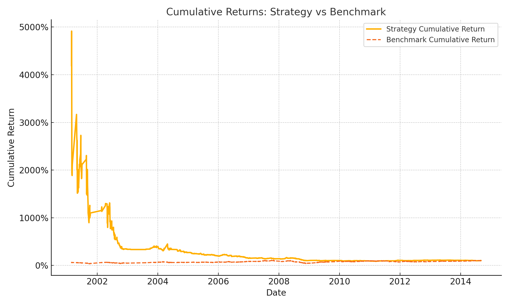

# TXF Strategy Performance Report

This repository provides a detailed performance evaluation of a 30-minute trend-following and volatility breakout strategy applied to the Taiwan Index Futures (TXF).

## 📈 Strategy vs Benchmark

## 📊 Key Metrics

| Metric | Value |
|--------|-------|
| Sharpe Ratio | 0.06 |
| CAGR | 0.19% |
| Max Drawdown | -44.45% |

## 🧮 Trade Statistics

| Metric | Value |
|--------|-------|
| Total Trades | 637 |
| Winning Trades | 346 |
| Losing Trades | 291 |
| Win Rate | 54.32% |
| Avg Win | 77939.02 |
| Avg Loss | -68844.33 |
| Profit Factor | 1.35 |

## 📁 Files Included

- `cumulative_returns.png` — Cumulative return plot
- `daily_returns.csv` — Daily returns time series
- `equity_curve.csv` — Strategy equity curve
- `benchmark.csv` — Benchmark returns
- `trade_list.csv` — Full trade-level data
- `strategy_analysis.csv` — Additional summary statistics
- `trading_analysis.csv` — Advanced metrics
