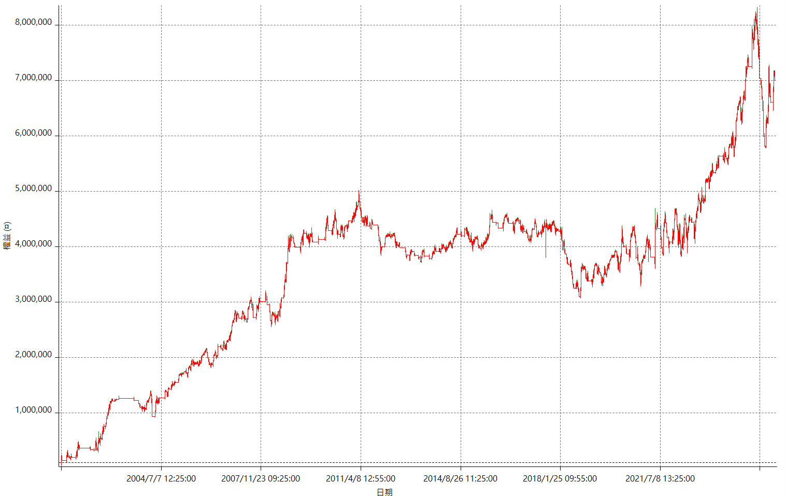

# Strategy Performance Summary

## Overview

This table provides a comprehensive summary of the strategy’s performance statistics over all trades, as well as broken down by long and short positions.

Key performance metrics include:
- Sharpe Ratio
- CAGR (Annualized Return)
- Maximum Drawdown
- Profit Factor
- Win Rate (%)
- Slippage & Commission Costs
- Gross/Net Profit and Loss

## Performance Table

| Metric                    |       All Trades |             Long |            Short |
|:--------------------------|-----------------:|-----------------:|-----------------:|
| Net Profit                |      6.842700  |      3.7453e+06  |      3.0974e+06  |
| Gross Profit              |      2.68764e+07 |      1.33549e+07 |      1.35215e+07 |
| Gross Loss                |     -2.00337e+07 |     -9.6096e+06  |     -1.04241e+07 |
| Adjusted Net Profit       |      4.21727e+06 |      1.78848e+06 |      1.31997e+06 |
| Adjusted Gross Profit     |      2.54294e+07 |      1.22681e+07 |      1.25507e+07 |
| Adjusted Gross Loss       |     -2.12122e+07 |     -1.04796e+07 |     -1.12307e+07 |
| Specific Net Profit       |      5.3466e+06  |      2.8882e+06  |      2.4584e+06  |
| Specific Gross Profit     |      1.82407e+07 |      8.4436e+06  |      9.7971e+06  |
| Specific Gross Loss       |     -1.28941e+07 |     -5.5554e+06  |     -7.3387e+06  |
| Capital Required          |      2.1414e+06  |      1.4724e+06  |      1.5114e+06  |
| Return on Capital         |    319.543       |    254.367       |    204.936       |
| Return on Initial Capital |   6842.7         |   3745.3         |   3097.4         |
| Max Strategy Drawdown     |     -2.5476e+06  |     -1.9902e+06  |     -1.6428e+06  |
| Max Strategy Drawdown (%) |    -55.9462      |    -89.5617      |    -62.3406      |
| Max Trade Drawdown        |     -2.1414e+06  |     -1.4724e+06  |     -1.5114e+06  |
| Max Trade Drawdown (%)    |    -37.4889      |    -80.5697      |    -60.0119      |
| Max DD-to-Return Ratio    |      2.68594     |      1.88187     |      1.88544     |
| Profit Factor             |      1.34156     |      1.38975     |      1.29714     |
| Adj. Profit Factor        |      1.19881     |      1.17066     |      1.11753     |
| Specific Profit Factor    |      1.41465     |      1.51989     |      1.33499     |
| Max Contracts Held        |      3           |      3           |      3           |
| Slippage Cost             |      1.184e+06   | 546000           | 638000           |
| Commission Cost           |      0           |      0           |      0           |
| Unrealized P/L            |  90500           |  90500           |    nan           |
| Annual Return (%)         |    279.939       |    153.223       |    126.717       |
| Monthly Return (%)        |     23.3283      |     12.7685      |     10.5597      |
| Buy & Hold Return         | 277361           | 400185           | 277361           |
| Avg Monthly Return        |  23662.8         |    nan           |    nan           |
| Monthly Return Std        | 183932           |    nan           |    nan           |
| Total Trades              |    636           |    274           |    362           |
| Win Rate (%)              |     54.2453      |     55.1095      |     53.5912      |

## Strategy Equity Curve

